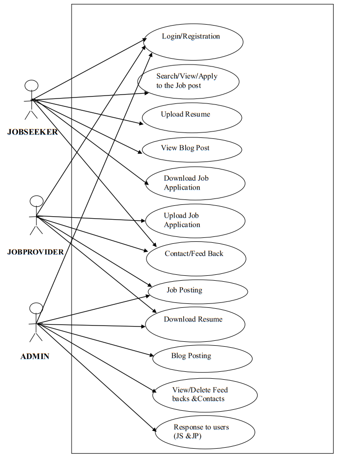
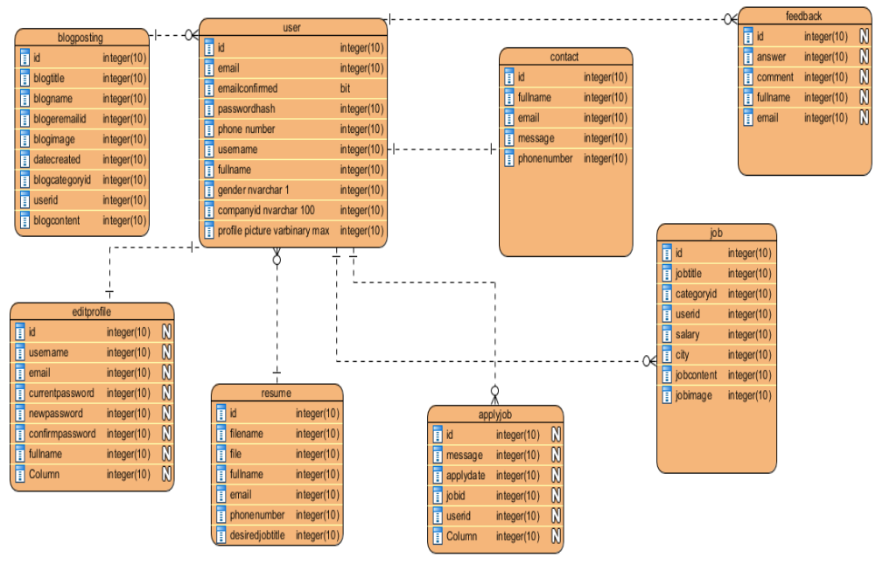

# 🏢 Job Shop – Online Job Portal


**Job Shop** is a dynamic **ASP.NET MVC** web application that bridges the gap between **job providers** (employers/companies) and **job seekers**.  
It provides a seamless platform where employers can **post jobs**, and job seekers can **search, apply, and upload resumes** effortlessly.

---

## 📜 Table of Contents
- [Overview](#-overview)
- [Problem Statement](#-problem-statement)
- [Proposed Solution](#-proposed-solution)
- [Scope](#-scope)
- [Objectives](#-objectives)
- [System Architecture & Methodology](#-system-architecture--methodology)
- [Modules](#-modules)
- [Use Cases & Diagrams](#-use-cases--diagrams)
- [Entity Relationship Diagram](#-entity-relationship-diagram)
- [Activity Diagram](#-activity-diagram)
- [Experimental Results](#-experimental-results)
- [System Testing](#-system-testing)
- [Tech Stack](#-tech-stack)
- [System Requirements](#-system-requirements)
- [Database Schema](#-database-schema)
- [Setup Instructions and Documentation](#-setup-instructions-documentation)

---

## 🌟 Overview
**Job Shop** connects **talent** with **opportunity** through a unified, user-friendly online portal.  
It serves two main user types:
- **Employers** – to post job openings and manage applicants.
- **Job Seekers** – to search and apply for relevant jobs.

Additionally, a **blogging module** and **feedback system** are included to build a community and enhance engagement.

---

## ❗ Problem Statement
Traditional job search and recruitment methods are:
- Time-consuming and inefficient.
- Based on outdated approaches like newspaper ads and manual CV submissions.
- Difficult for both employers and job seekers to manage effectively.

Current online platforms have **dull interfaces**, **limited features**, and lack efficient search/filtering options.

---

## 💡 Proposed Solution
The **Job Shop** platform aims to solve these issues by:
- Providing **digital resume submission** and **job application** workflows.
- Enabling **employers** to review applications, download resumes, and communicate directly with candidates.
- Offering **search filters** by **job title**, **city**, **category**, and **salary**.
- Introducing a **blog system** for career advice and news.

---

## 📌 Scope
- Centralized portal for both **job seekers** and **employers**.
- Provides admin management for users, jobs, resumes, and blogs.
- Allows job seekers to **create public profiles**, **upload resumes**, and **track applications**.
- Employers can **search candidates**, **create job listings**, and **manage applications**.

---

## 🎯 Objectives
- Build a **dynamic web platform** that connects job seekers and employers.
- Enable job providers to post detailed job descriptions and view applications.
- Allow job seekers to **search**, **apply**, and **upload resumes** securely.
- Provide a **feedback system** for continuous improvement.

---

## 🏗 System Architecture & Methodology

### Methodology Workflow:
The system is divided into three roles:
1. **Admin**  
   - Manages categories, users, jobs, resumes, blogs, and overall system integrity.

2. **Employer**  
   - Posts jobs, manages applicants, and downloads resumes.

3. **Job Seeker**  
   - Searches jobs, uploads resumes, applies for positions. 

---

## 🧩 Modules

### **1. Admin**
- Manage users (add, delete, view).
- Manage job categories and posts.
- Approve/reject resumes.
- View feedback and contact messages.
- Notify users of updates.

### **2. Employer**
- Register/login to create a profile.
- Post and manage job listings.
- View and download resumes of applicants.
- Send messages to job seekers.

### **3. Job Seeker**
- Register/login to create a profile.
- Search for jobs using filters.
- Apply for jobs and send application messages.
- Upload multiple resume formats (PDF, DOC, TXT).

---

## 📝 Use Cases & Diagrams

### Primary Use Cases:
1. **Login/Registration**
2. **Job Posting**
3. **Job Search & Application**
4. **Resume Upload**
5. **Resume Download**
6. **Blog Management**
7. **Feedback Submission**

<p align="center">
  
</p>  
                                         <p align="center"> <b>Use Case Diagram</b> </p>      

---

## 📊 Entity Relationship Diagram
The ERD defines relationships between entities such as:
- Users
- Jobs
- Job Categories
- Resumes
- Blogs
- Feedback

<p align="center">
  
</p>  
                                         <p align="center"> <b>ER Diagram</b> </p>  

---

## 🔄 Activity Diagram
The activity flow of the system, from registration to job application and admin actions.

---

## 🧪 Experimental Results
During development, the following experiments were conducted:
- Multi-role login and authentication.
- Job posting and management tests.
- Resume upload/download functionality.
- Blog posting system verification.
- Search filter performance testing.

Results showed smooth, error-free operation under expected workloads.

---

## 🧾 System Testing

### Types of Testing:
1. **Unit Testing** – Verify individual modules.
2. **Black Box Testing** – Validate external behavior.
3. **Integration Testing** – Ensure modules work together.
4. **System Testing** – Validate end-to-end workflows.
5. **Acceptance Testing** – Final verification by stakeholders.

### Test Plan Table:
| **Test Case**            | **Status** |
| ------------------------ | ---------- |
| Registration/Login       | ✅ Passed  |
| Job Posting              | ✅ Passed  |
| Search/View/Apply to Job | ✅ Passed  |
| Resume Upload            | ✅ Passed  |
| Blog Posting             | ✅ Passed  |
| Logout                   | ✅ Passed  |

---

## 🛠 Tech Stack

| **Category**        | **Technology** |
| ------------------- | -------------- |
| **Frontend**        | HTML5, CSS3, Bootstrap, JavaScript, jQuery, Razor |
| **Backend**         | ASP.NET MVC 5 |
| **Database**        | Microsoft SQL Server 2017 |
| **Tools**           | Visual Studio 2017, Notepad++ |
| **Version Control** | Git & GitHub |

---

## 💻 System Requirements

| **Component** | **Minimum Specs** |
| ------------- | ----------------- |
| **Processor** | Intel Core i5 |
| **RAM**       | 4 GB |
| **Storage**   | 500 MB |
| **OS**        | Windows 7/10/11 |
| **IDE**       | Visual Studio 2017 or above |


---


## 🗃 Database Schema
The database is implemented using **Entity Framework Code-First**.  
Tables include:
- Users
- Jobs
- Categories
- Resumes
- Blogs
- Feedback


---


## ⚙️ Setup Instructions and 💻 Documentation

Clone the Repository

```bash
git clone https://github.com/yourusername/job-shop.git
cd job-shop
Documentation available upon Request!
---
